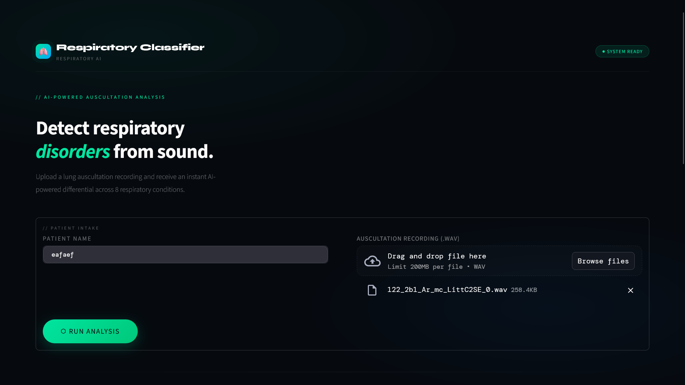
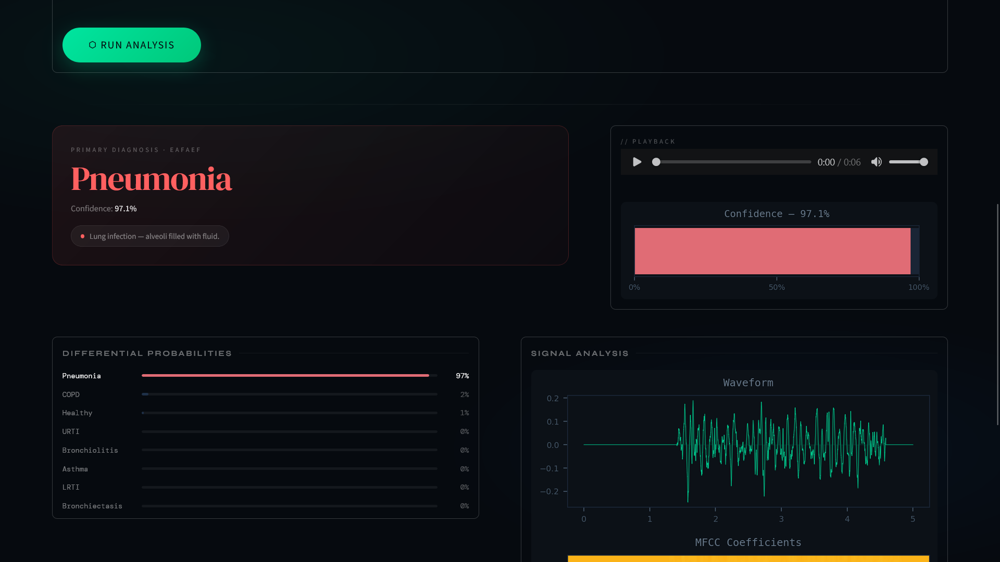
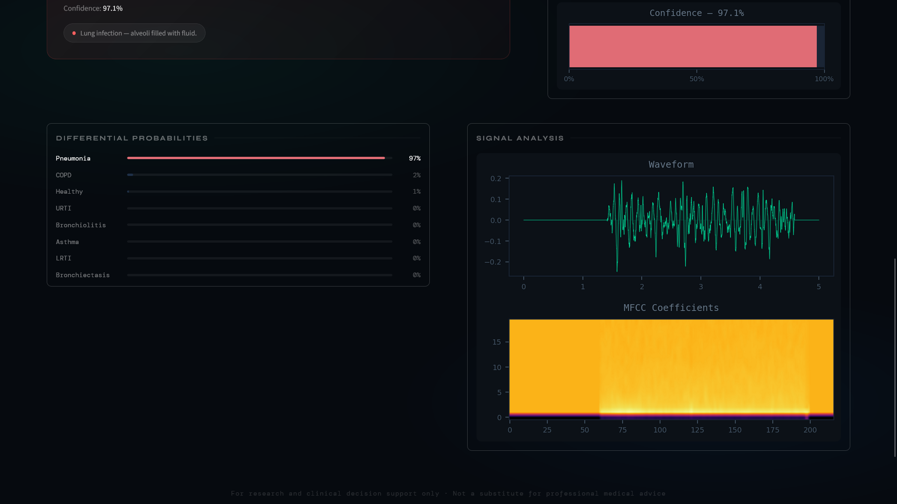

# Respiratory Classifier
Respiratory sounds are important indicators of respiratory health and respiratory disorders. The sound emitted when a person breathes is directly related to air movement, changes within lung tissue and the position of secretions within the lung. A wheezing sound, for example, is a common sign that a patient has an obstructive airway disease like asthma or chronic obstructive pulmonary disease (COPD). These sounds can be recorded using digital stethoscopes and other recording techniques. This digital data opens up the possibility of using machine learning to automatically diagnose respiratory disorders like asthma, pneumonia and bronchiolitis, to name a few.

---

### Screenshots

**Upload & Analysis**


**Diagnosis Results**


**Signal Analysis**


---

### Dataset
Respiratory Sound Database: https://www.kaggle.com/vbookshelf/respiratory-sound-database
The dataset includes 920 annotated recordings of varying length - 10s to 90s. These recordings were taken from 126 patients. There are a total of 5.5 hours of recordings containing 6898 respiratory cycles - 1864 contain crackles, 886 contain wheezes and 506 contain both crackles and wheezes.

---

### Model Results
| Feature Set | Accuracy | Loss | Inference Time |
|---|---|---|---|
| MFCC only | 86.55% | 34.69% | ~99.75 ms |
| Chroma STFT only | 82.96% | 58.54% | ~93.68 ms |
| Mel Spectrogram only | 85.68% | 46.57% | ~83.74 ms |
| **All Combined (Final Model)** | **94.90%** | **17.27%** | **~126.66 ms** |

---

### Requirements
To get started with the project make sure you have Python 3.9+ installed.
> Note: The `backend` folder has a separate `requirements.txt` to support the Linux Docker environment.
```
pip install -r requirements.txt
```

---

### Folder Setup
Here is a detailed folder setup to help you get started:
```
Respiratory-Classification (Main Project Folder)
├── Respiratory_Sound_Database/
│   └── audio_and_txt_files/, etc.
├── backend/
│   ├── streamlit_app.py
│   ├── app.py
│   ├── rdc_model.py
│   ├── model/
│   ├── Dockerfile
│   └── requirements.txt
├── processed_audio_files/
├── training/
│   └── train.csv
├── validation/
│   └── val.csv
├── venv/
├── .gitignore
├── demographic_info.txt
├── README.md
└── respiratory_classification.ipynb
```
Creating a virtual environment (Windows):
1. `python -m venv C:\Users\<YourUsername>\<ProjectFolderPath>\venv`
2. Give permission: `Set-ExecutionPolicy -Scope CurrentUser -ExecutionPolicy Unrestricted`
3. Activate: `.\venv\Scripts\activate.ps1`
4. Install packages: `pip install -r requirements.txt`

GPU support for TensorFlow: https://www.youtube.com/watch?v=hHWkvEcDBO0

---

### Streamlit App
The Streamlit app can be found in the `backend` folder.
To run locally:
```
cd backend
streamlit run streamlit_app.py
```

---

### Docker Image
- https://hub.docker.com/r/manyyetone/respiratory-classifier

### Running with Docker
```
cd backend
docker build -t respiratory-app .
docker run -p 8501:8501 respiratory-app
```
Then open **http://localhost:8501** in your browser.
